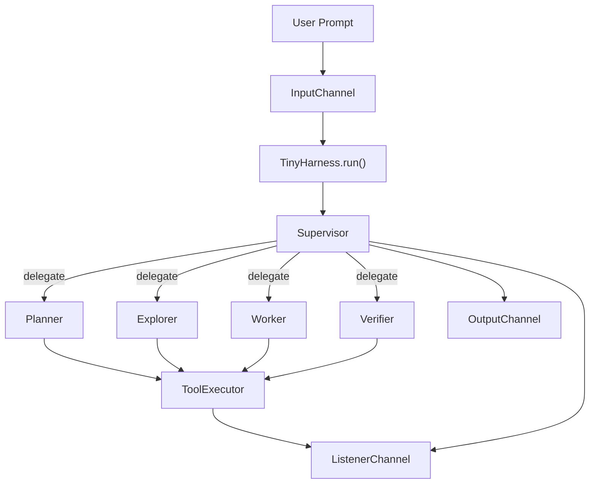

# tiny-agent-harness

A toy project that reverse-engineers and mimics the harness agent architecture found in tools like **OpenAI Codex CLI** and **Anthropic Claude Code** — a supervisor-led multi-agent loop that plans, executes, and reviews tasks against a local workspace.

Built to be small and readable. Every layer (LLM client, tool caller, agent loop, channels) is explicit and inspectable, with no hidden magic.

## Architecture



The supervisor is not a fixed `planner -> explorer -> worker -> verifier` chain.
It chooses which subagent to call next and can call the same type more than once.

## Quick Start

Install directly from GitHub — no clone needed:

```bash
uv pip install git+https://github.com/junyeong-nero/tiny-agent-harness.git
export OPENAI_API_KEY=your_key_here
tiny-agent --workspace .
```

For OpenRouter:

```bash
uv pip install git+https://github.com/junyeong-nero/tiny-agent-harness.git
export OPENROUTER_API_KEY=your_key_here
tiny-agent --workspace . --config config.yaml
```

## Usage

### CLI

```bash
# Interactive mode
tiny-agent --workspace .

# One-shot prompt
tiny-agent --workspace . "inspect this repository and summarize the architecture"

# With a custom config
tiny-agent --workspace . --config config.yaml
```

Interactive mode provides:

- a banner showing workspace, config, and command hints
- structured live event lines: `RUN`, `NOTE`, `TOOL`, `DONE`, `FAIL`
- a formatted final result block
- built-in commands: `help`, `clear`, `exit`, `quit`

Color output is enabled only when stdout is a TTY. Set `NO_COLOR=1` to force plain output.

### Programmatic Usage

```python
from tiny_agent_harness.harness import TinyHarness
from tiny_agent_harness.schemas import load_config

config = load_config("config.yaml")
harness = TinyHarness(config=config, workspace_root=".")

harness.ch_output.add_channel(
    "print",
    lambda _, event: print(event.payload.summary),
)

harness.ch_input.queue("inspect the repository and summarize the current pipeline")
harness.run()
```

To collect listener events:

```python
events = []
harness.ch_listener.add_channel(
    "capture",
    lambda _, event: events.append(event),
)
```

### Configuration

Configuration is loaded from `--config <path>`, or the packaged `default_config.yaml` if omitted.

```yaml
provider: openai

models:
  default: gpt-4o-mini
  supervisor: gpt-4o-mini
  planner: gpt-4o-mini
  explorer: gpt-4o-mini
  worker: gpt-4o-mini
  verifier: gpt-4o-mini

llm:
  max_retries: 10

tools:
  supervisor: []
  planner:
    - list_files
    - search
    - glob
  explorer:
    - list_files
    - search
    - glob
    - read_file
    - git_status
    - git_diff
  worker:
    - bash
    - read_file
    - search
    - glob
    - list_files
    - replace_in_file
    - apply_patch
    - git_status
  verifier:
    - read_file
    - search
    - glob
    - list_files
    - git_status
    - git_diff
```

There is no `runtime:` block in the current config schema. Agent loop limits are still internal defaults.

#### Backward-Compatible Aliases

- `orchestrator` → `planner`
- `executor` → `worker`

## How It Works

### Runtime Flow

For each queued prompt:

1. `TinyHarness._run()` emits a `run_started` event.
2. The harness invokes `SupervisorAgent.run(...)`.
3. The supervisor decides whether to return a final answer, fail, or delegate to a subagent.
4. Delegated agents execute through the shared `ToolExecutor`.
5. Tool and LLM events are emitted through the listener channel.
6. The final summary is published through the output channel as a `run_result`.

`LLMClient.chat_structured()` retries provider failures and structured-output validation failures up to `llm.max_retries`. Provider failures do not append a failed assistant turn to history; invalid JSON or schema mismatches do append the assistant output plus a correction prompt before retrying.

The harness does not currently retry an entire supervisor pass after a failed run.

### Pipeline Agents

#### Supervisor

Orchestrates the entire run. Dispatches up to 10 subagent steps per run before treating it as failed.

- Input: `SupervisorInput(task=...)`
- Output: `SupervisorOutput` with status `subagent_call | completed | failed`

#### Planner

Read-only analysis agent. Inspects the workspace and produces a structured plan.

- Input: `PlannerInput(task=...)`
- Output: `PlannerOutput` with `summary` and optional `plans`
- Tools: `list_files`, `search`, `glob`

#### Explorer

Read-mostly context-gathering agent. It helps the supervisor inspect files and diffs before implementation or verification.

- Input: `ExploreInput(task=...)`
- Output: `ExploreOutput` with `findings` and optional `sources`
- Tools: `list_files`, `search`, `glob`, `read_file`, `git_status`, `git_diff`

#### Worker

Performs concrete workspace edits and shell commands.

- Input: `WorkerInput(task=..., kind=...)`
- Output: `WorkerOutput` with `summary`, `artifacts`, `changed_files`, `test_results`
- Tools: `bash`, `read_file`, `search`, `glob`, `list_files`, `replace_in_file`, `apply_patch`, `git_status`

#### Verifier

Validates the worker's output.

- Input: `VerifierInput(task=...)`
- Output: `VerifierOutput` with `decision`, `feedback`, `status`
- Tools: `read_file`, `search`, `glob`, `list_files`, `git_status`, `git_diff`

#### Shared Agent Loop

Planner, explorer, worker, and verifier run through `ToolCallingAgent`, which:

- builds a role-specific prompt,
- asks the LLM for structured JSON,
- turns unknown, disallowed, and invalid tool calls into `ToolResult(ok=False)`,
- executes a tool call when present,
- feeds the tool result back into the conversation,
- lets the model respond to failed tool results on the next step,
- returns a schema-valid `status="failed"` result if a pending `tool_call` remains after the step budget is exhausted,
- stops when no `tool_call` is returned.

### Failure Semantics

- Tool failures are recoverable inside the tool loop. Unknown tools, disallowed tools, invalid arguments, and runtime tool exceptions become `ToolResult(ok=False)` plus a `tool_call_finished` event.
- Step-limit exhaustion is explicit. If a subagent still has a pending `tool_call` after its internal step budget, it returns `status="failed"` instead of looking completed.
- Supervisor failures are explicit too. A failed subagent result, or a pending subagent call after the supervisor loop budget, produces a final supervisor result with `status="failed"`.

### Built-in Tools

| Tool | Description |
|------|-------------|
| `bash` | Run shell commands |
| `read_file` | Read a file from the workspace |
| `search` | Search file contents |
| `glob` | Find files matching a glob pattern |
| `list_files` | List files in a directory |
| `replace_in_file` | Replace exact text in a file |
| `apply_patch` | Apply a unified diff patch |
| `git_status` | Show git status output |
| `git_diff` | Show git diff output |

### Events

The listener channel emits:

- `run_started`, `run_completed`, `run_failed`
- `llm_request`, `llm_response`, `llm_error`
- `tool_call_started`, `tool_call_finished`

The output channel emits `run_result` events whose payload is a `Response`.

### Repository Layout

```text
src/
  tiny_agent_harness/
    agents/
      explore/
      planner/
      verifier/
      supervisor/
      worker/
    channels/
    llm/
    providers/
    schemas/
    tools/
    cli.py
    default_config.yaml
    harness.py
tests/
  test_cli.py
  test_explore_agent.py
  test_harness.py
  test_planner_agent.py
  test_verifier_agent.py
  test_supervisor_agent.py
  test_worker_agent.py
config.yaml
```

## Development

### From Source

```bash
git clone https://github.com/junyeong-nero/tiny-agent-harness.git
cd tiny-agent-harness
uv sync
export OPENAI_API_KEY=your_key_here
uv run tiny-agent --workspace .
```

To invoke the module directly:

```bash
env PYTHONPATH=src uv run python -m tiny_agent_harness.cli --workspace .
```

### Testing

```bash
env PYTHONPATH=src uv run pytest
```

```bash
env PYTHONPATH=src uv run pytest tests/test_cli.py
```

Test coverage focuses on `SupervisorAgent`, `PlannerAgent`, `ExploreAgent`, `WorkerAgent`, `VerifierAgent`, the harness loop, and CLI rendering.

### Current Limitations

- Per-agent `max_tool_steps` values are still hard-coded in agent classes. The current defaults are `3` for planner, explorer, worker, and verifier.
- The supervisor's subagent loop limit is still hard-coded to `10`.
- The CLI exposes planner, worker, and verifier more directly than explorer, even though explorer is available to the supervisor.
- The CLI requires a real provider API key because `create_llm_client()` resolves credentials eagerly.
- Provider support is limited to OpenAI and OpenRouter chat-completions style APIs.

### Follow-up Candidates

- Externalize the supervisor and subagent step limits into config instead of keeping them hard-coded.
- Expose explorer more consistently in CLI status/help output and user-facing workflow docs.
- Keep tightening public exports now that import-surface tests are in place.
