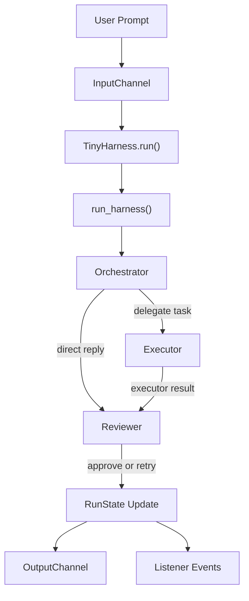

# tiny-agent-harness

`tiny-agent-harness` is a small, inspectable multi-agent runtime for a fixed
`orchestrator -> executor -> reviewer` loop over a local workspace.

It is intentionally simple:

- one config file
- one interactive CLI
- a small set of workspace tools
- direct HTTP provider adapters
- Pydantic schemas for agent I/O and tool calls

## What Exists Today

The current codebase includes:

- **Package Runtime:** Located in `src/tiny_agent_harness/`, providing the core logic.
- **Interactive CLI:** An entrypoint in [`src/cli.py`](src/cli.py) for running the harness.
- **Provider Adapters:** Native support for OpenAI and OpenRouter.
- **LLM Client:** A robust, schema-driven client with structured JSON validation and automated retries.
- **Tool System:** Per-agent tool permissions enforced by a shared `ToolCaller`.
- **Event System:** Listener and output channels for real-time runtime events.
- **Workspace Tools:**
  - `bash`: execute shell commands
  - `read_file`: read whole files or specific line ranges
  - `search`: grep-like text searching
  - `list_files`: recursive file listing
  - `apply_patch`: apply unified diffs
  - `git_diff`: inspect git changes

## Architecture

The harness always uses three agents in a specific loop:

1. `orchestrator`: Analyzes the goal and plans or replies.
2. `executor`: Performs the actual workspace operations.
3. `reviewer`: Verifies the outcome against the original user prompt.

High-level flow:

```text
user prompt
  -> InputChannel
  -> TinyHarness.run()
  -> run_harness()
  -> orchestrator
  -> executor (delegated by orchestrator)
  -> reviewer
  -> OutputChannel + listener events
```

Mermaid view:



### Agent responsibilities

- `orchestrator`
  - receives the overall goal as `RunState`
  - may return a direct reply for simple conversational inputs
  - may inspect the workspace with read-only tools (`list_files`, `search`)
  - may delegate an `ExecutorInput` task to the executor
- `executor`
  - receives a concrete task plus an allowed tool subset
  - loops through tool calls until it returns `completed` or `failed`
- `reviewer`
  - evaluates the reply or executor result against the original prompt
  - may inspect the workspace using allowed tools before deciding `approve` or `retry`

### Runtime loop

`run_harness()` repeats the orchestration cycle until either:

- the reviewer returns `approve`, or
- `runtime.orchestrator_max_retries` is exhausted

Each agent loop is bounded separately by tool step limits in `config.yaml`. If the orchestrator fails to produce a valid delegation after its tool loop, the runtime creates a fallback executor task from the original user prompt.

## Repository Layout

```text
src/
  cli.py                       # Main CLI entrypoint
  tiny_agent_harness/
    agents/                    # Agent-specific logic and prompts
      orchestrator/
      executor/
      reviewer/
    channels/                  # I/O and event channels
    llm/                       # LLM client and provider factory
    providers/                 # HTTP adapters for providers
    schemas/                   # Pydantic models for the system
    tools/                     # Built-in workspace tools
    skills/                    # (Empty) reserved for future use
    harness.py                 # Core runtime orchestration
tests/                         # Unittest suite
config.yaml                    # System configuration
```

## Configuration

Configuration is loaded from [`config.yaml`](config.yaml).

Current checked-in defaults:

```yaml
provider: openai

models:
  default: gpt-4o-mini
  orchestrator: gpt-4o-mini
  executor: gpt-4o-mini
  reviewer: gpt-4o-mini

llm:
  max_retries: 10

runtime:
  orchestrator_max_retries: 3
  orchestrator_max_tool_steps: 10
  executor_max_tool_steps: 10
  reviewer_max_tool_steps: 10
```

### Tool Permissions

Tool permissions are defined in `config.yaml`, with some internal hard-coding:

- **Orchestrator:** Hard-limited in code to `list_files` and `search` for safety.
- **Executor:** Uses the subset of tools passed by the orchestrator in `ExecutorInput.allowed_tools`.
- **Reviewer:** Uses the tools explicitly granted in `config.yaml`.

## Running Locally

1. **Install dependencies:**
   ```bash
   uv sync
   ```

2. **Set API Key:**
   The default config uses OpenAI:
   ```bash
   export OPENAI_API_KEY=your_key_here
   ```

3. **Start the CLI:**
   ```bash
   python3 src/cli.py
   ```

To use OpenRouter, switch `provider: openrouter` in `config.yaml` and set `OPENROUTER_API_KEY`.

## Programmatic Usage

```python
from tiny_agent_harness.harness import run_harness
from tiny_agent_harness.schemas import RunRequest, load_config

config = load_config("config.yaml")
state, result = run_harness(RunRequest(prompt="inspect the repo"), config)
```

For interactive applications, use the `TinyHarness` class which manages the channels and event loops.

## Events and Output

The runtime emits listener events for `run_started`, `run_completed`, `run_failed`, `llm_request`, `llm_response`, `llm_error`, `tool_call_started`, and `tool_call_finished`.

The CLI provides a `console_listener` that prints real-time activity and summaries.

## Tests

Run the test suite with:

```bash
python3 -m unittest discover -s tests
```

**Note:** At the moment, some tests still target older interfaces and do not pass against the current source tree. The code in `src/` is the authoritative reference for current behavior.

## Current Limitations

- **Skills:** The `skills/` directory is present but currently empty and not implemented.
- **Mock Mode:** While `run_harness()` has mock behavior, the CLI currently requires a valid provider API key to initialize.
- **Entrypoint:** The project uses `src/cli.py` as the main entrypoint; there is no root-level `main.py` or packaged console script.
