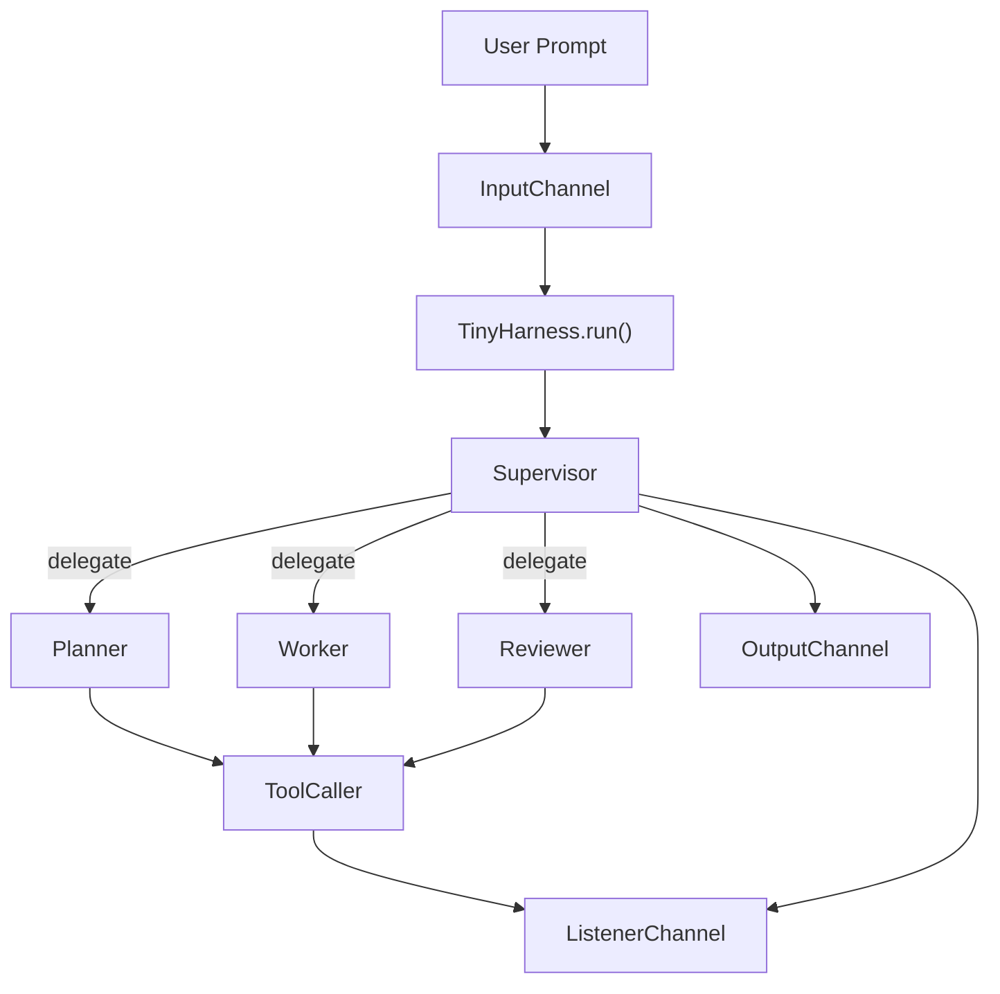

# tiny-agent-harness

`tiny-agent-harness` is a small, inspectable multi-agent runtime for working against a local workspace.

The current codebase is built around a supervisor-led pipeline:

```text
user prompt
  -> InputChannel
  -> TinyHarness.run()
  -> supervisor
  -> planner / worker / reviewer subagent calls
  -> OutputChannel + listener events
```

It is intentionally narrow:

- one packaged CLI
- one shared tool layer over a workspace root
- one schema-driven LLM client
- direct provider adapters for OpenAI and OpenRouter
- explicit Pydantic models for agent I/O, config, and events

## Current Runtime

The runtime entrypoint is `TinyHarness` in `src/tiny_agent_harness/harness.py`.

For each queued prompt:

1. `TinyHarness._run()` emits a `run_started` listener event.
2. The harness invokes `supervisor_agent(...)`.
3. The supervisor decides whether to:
   - return a final answer,
   - fail, or
   - delegate a task to `planner`, `worker`, or `reviewer`.
4. Delegated agents execute through the shared `ToolCaller`.
5. Tool and LLM events are emitted through the listener channel.
6. The final summary is published through the output channel as a `run_result`.

At the harness level, the full supervisor pass is retried up to `runtime.supervisor_max_retries`.

## Pipeline Details

### Supervisor

The supervisor is the orchestrator for the whole run.

- Input: `SupervisorInput(task=...)`
- Output: `SupervisorOutput`
- Statuses:
  - `subagent_call`
  - `completed`
  - `failed`

Inside a single supervisor run, it can dispatch up to 10 subagent steps before the run is treated as failed.

### Planner

The planner is a tool-using analysis agent.

- It receives `PlannerInput(task=...)`.
- It can inspect the workspace with read-oriented tools.
- It returns `PlannerOutput` with a summary and optional `plans`.

### Worker

The worker performs concrete workspace work.

- It receives `WorkerInput(task=..., kind=...)`.
- It can use editing and shell tools allowed by the active config.
- It returns `WorkerOutput` including:
  - `summary`
  - `artifacts`
  - `changed_files`
  - `test_results`

### Reviewer

The reviewer validates the result.

- It receives `ReviewerInput(task=...)`.
- It can inspect files and diffs.
- It returns `ReviewerOutput` with:
  - `decision`
  - `feedback`
  - `status`

### Shared Agent Loop

`planner`, `worker`, and `reviewer` all run through `BaseAgent`.

That shared loop:

- builds a role-specific prompt,
- asks the LLM for structured JSON,
- executes a requested tool call when present,
- feeds the tool result back into the conversation,
- stops when the agent returns without a `tool_call`.

Today, those agents use an internal default limit of 3 tool-assisted steps each.

## Architecture



This is not a hard-coded linear `planner -> worker -> reviewer` chain.
The supervisor chooses which subagent to call next and can call the same type more than once.

## Repository Layout

```text
src/
  tiny_agent_harness/
    agents/
      planner/
      reviewer/
      supervisor/
      worker/
    channels/
    llm/
    providers/
    schemas/
    tools/
    cli.py
    default_config.yaml
    harness.py
tests/
  test_cli.py
  test_planner_agent.py
  test_reviewer_agent.py
  test_supervisor_agent.py
  test_worker_agent.py
config.yaml
```

## Built-in Tools

The default tool registry includes:

- `bash`
- `read_file`
- `search`
- `list_files`
- `apply_patch`
- `git_diff`

Actor permissions are enforced by `ToolCaller` using the active config.

The packaged default config currently grants:

- `supervisor`: no direct tools
- `planner`: `list_files`, `search`
- `worker`: `bash`, `read_file`, `search`, `list_files`, `apply_patch`
- `reviewer`: `read_file`, `search`, `list_files`, `git_diff`

## CLI

The packaged CLI entrypoint is `tiny-agent`, backed by `src/tiny_agent_harness/cli.py`.

Interactive mode now provides:

- a banner showing workspace, config, and command hints
- structured live event lines such as `RUN`, `NOTE`, `TOOL`, `DONE`, `FAIL`
- a formatted final result block
- built-in commands:
  - `help`
  - `clear`
  - `exit`
  - `quit`

Color output is enabled only when stdout is a TTY. Set `NO_COLOR=1` to force plain output.

## Configuration

Configuration is loaded from:

- `--config <path>` when provided
- otherwise the packaged `default_config.yaml`

Current default shape:

```yaml
provider: openai

models:
  default: gpt-4o-mini
  supervisor: gpt-4o-mini
  planner: gpt-4o-mini
  worker: gpt-4o-mini
  reviewer: gpt-4o-mini

llm:
  max_retries: 10

runtime:
  supervisor_max_retries: 3
  planner_max_tool_steps: 10
  worker_max_tool_steps: 10
  reviewer_max_tool_steps: 10

tools:
  supervisor: []
  planner:
    - list_files
    - search
  worker:
    - bash
    - read_file
    - search
    - list_files
    - apply_patch
  reviewer:
    - read_file
    - search
    - list_files
    - git_diff
```

### Backward-Compatible Aliases

The config schema still accepts some older names:

- `orchestrator` as an alias for `planner`
- `executor` as an alias for `worker`
- `orchestrator_max_retries` as an alias for `supervisor_max_retries`
- `orchestrator_max_tool_steps` as an alias for `planner_max_tool_steps`
- `executor_max_tool_steps` as an alias for `worker_max_tool_steps`

## Running Locally

1. Install dependencies:

```bash
uv sync
```

2. Export an API key for the selected provider:

```bash
export OPENAI_API_KEY=your_key_here
```

For OpenRouter:

```bash
export OPENROUTER_API_KEY=your_key_here
```

3. Start the interactive CLI:

```bash
uv run tiny-agent --workspace .
```

4. Or run a one-shot prompt:

```bash
uv run tiny-agent --workspace . "inspect this repository and summarize the architecture"
```

To use a specific config file:

```bash
uv run tiny-agent --workspace . --config config.yaml
```

If you prefer invoking the module directly:

```bash
env PYTHONPATH=src uv run python -m tiny_agent_harness.cli --workspace .
```

## Programmatic Usage

The stable entrypoint today is `TinyHarness`, not `run_harness()`.

Minimal example:

```python
from tiny_agent_harness.harness import TinyHarness
from tiny_agent_harness.schemas import load_config

config = load_config("config.yaml")
harness = TinyHarness(config=config, workspace_root=".")

harness.ch_output.add_channel(
    "print",
    lambda _, event: print(event.payload.summary),
)

harness.ch_input.queue("inspect the repository and summarize the current pipeline")
harness.run()
```

To collect listener events:

```python
events = []
harness.ch_listener.add_channel(
    "capture",
    lambda _, event: events.append(event),
)
```

## Events

The listener channel emits:

- `run_started`
- `run_completed`
- `run_failed`
- `llm_request`
- `llm_response`
- `llm_error`
- `tool_call_started`
- `tool_call_finished`

The output channel emits `run_result` events whose payload is a `Response`.

## Testing

Run the full suite with:

```bash
env PYTHONPATH=src uv run pytest
```

Run a focused CLI regression test with:

```bash
env PYTHONPATH=src uv run pytest tests/test_cli.py
```

Current test coverage in the repository focuses on:

- `SupervisorAgent`
- `PlannerAgent`
- `WorkerAgent`
- `ReviewerAgent`
- CLI rendering

## Current Limitations

- The runtime config schema includes per-agent tool-step settings, but the current agent classes still use internal default step limits rather than reading those config values.
- The supervisor's internal subagent loop limit is currently hard-coded to 10.
- `explorer` support exists in the config and model routing layer, but there is no dedicated explorer agent module in the current runtime.
- The CLI requires a real provider API key because `create_llm_client()` resolves credentials eagerly.
- Provider support is currently limited to OpenAI and OpenRouter chat-completions style APIs.
