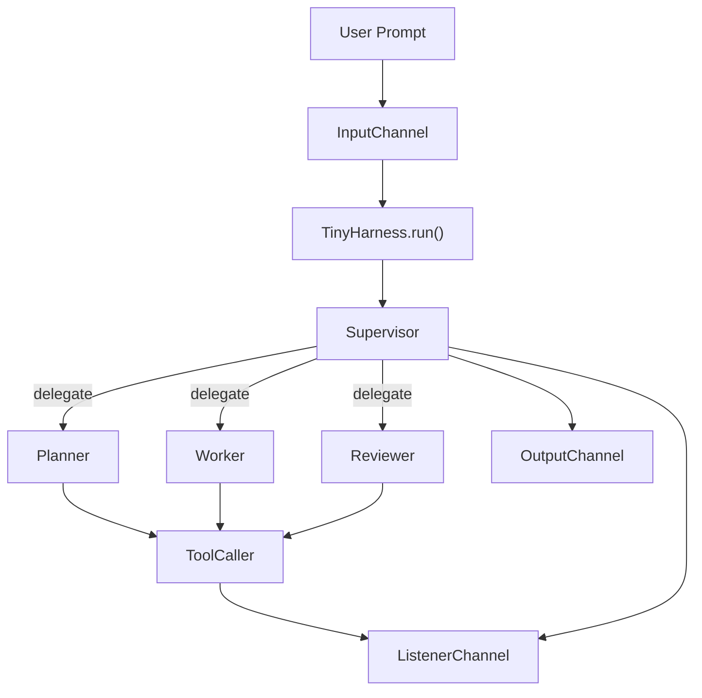

# tiny-agent-harness

A toy project that reverse-engineers and mimics the harness agent architecture found in tools like **OpenAI Codex CLI** and **Anthropic Claude Code** — a supervisor-led multi-agent loop that plans, executes, and reviews tasks against a local workspace.

Built to be small and readable. Every layer (LLM client, tool caller, agent loop, channels) is explicit and inspectable, with no hidden magic.

## Architecture



The supervisor is not a fixed `planner -> worker -> reviewer` chain.
It chooses which subagent to call next and can call the same type more than once.

## Quick Start

Install directly from GitHub — no clone needed:

```bash
uv pip install git+https://github.com/junyeong-nero/tiny-agent-harness.git
export OPENAI_API_KEY=your_key_here
tiny-agent --workspace .
```

For OpenRouter:

```bash
uv pip install git+https://github.com/junyeong-nero/tiny-agent-harness.git
export OPENROUTER_API_KEY=your_key_here
tiny-agent --workspace . --config config.yaml
```

## Usage

### CLI

```bash
# Interactive mode
tiny-agent --workspace .

# One-shot prompt
tiny-agent --workspace . "inspect this repository and summarize the architecture"

# With a custom config
tiny-agent --workspace . --config config.yaml
```

Interactive mode provides:

- a banner showing workspace, config, and command hints
- structured live event lines: `RUN`, `NOTE`, `TOOL`, `DONE`, `FAIL`
- a formatted final result block
- built-in commands: `help`, `clear`, `exit`, `quit`

Color output is enabled only when stdout is a TTY. Set `NO_COLOR=1` to force plain output.

### Programmatic Usage

```python
from tiny_agent_harness.harness import TinyHarness
from tiny_agent_harness.schemas import load_config

config = load_config("config.yaml")
harness = TinyHarness(config=config, workspace_root=".")

harness.ch_output.add_channel(
    "print",
    lambda _, event: print(event.payload.summary),
)

harness.ch_input.queue("inspect the repository and summarize the current pipeline")
harness.run()
```

To collect listener events:

```python
events = []
harness.ch_listener.add_channel(
    "capture",
    lambda _, event: events.append(event),
)
```

### Configuration

Configuration is loaded from `--config <path>`, or the packaged `default_config.yaml` if omitted.

```yaml
provider: openai

models:
  default: gpt-4o-mini
  supervisor: gpt-4o-mini
  planner: gpt-4o-mini
  worker: gpt-4o-mini
  reviewer: gpt-4o-mini

llm:
  max_retries: 10

runtime:
  supervisor_max_retries: 3
  planner_max_tool_steps: 10
  worker_max_tool_steps: 10
  reviewer_max_tool_steps: 10

tools:
  supervisor: []
  planner:
    - list_files
    - search
  worker:
    - bash
    - read_file
    - search
    - list_files
    - apply_patch
  reviewer:
    - read_file
    - search
    - list_files
    - git_diff
```

#### Backward-Compatible Aliases

- `orchestrator` → `planner`
- `executor` → `worker`
- `orchestrator_max_retries` → `supervisor_max_retries`
- `orchestrator_max_tool_steps` → `planner_max_tool_steps`
- `executor_max_tool_steps` → `worker_max_tool_steps`

## How It Works

### Runtime Flow

For each queued prompt:

1. `TinyHarness._run()` emits a `run_started` event.
2. The harness invokes `supervisor_agent(...)`.
3. The supervisor decides whether to return a final answer, fail, or delegate to a subagent.
4. Delegated agents execute through the shared `ToolCaller`.
5. Tool and LLM events are emitted through the listener channel.
6. The final summary is published through the output channel as a `run_result`.

The full supervisor pass is retried up to `runtime.supervisor_max_retries` on failure.

### Pipeline Agents

#### Supervisor

Orchestrates the entire run. Dispatches up to 10 subagent steps per run before treating it as failed.

- Input: `SupervisorInput(task=...)`
- Output: `SupervisorOutput` with status `subagent_call | completed | failed`

#### Planner

Read-only analysis agent. Inspects the workspace and produces a structured plan.

- Input: `PlannerInput(task=...)`
- Output: `PlannerOutput` with `summary` and optional `plans`
- Tools: `list_files`, `search`

#### Worker

Performs concrete workspace edits and shell commands.

- Input: `WorkerInput(task=..., kind=...)`
- Output: `WorkerOutput` with `summary`, `artifacts`, `changed_files`, `test_results`
- Tools: `bash`, `read_file`, `search`, `list_files`, `apply_patch`

#### Reviewer

Validates the worker's output.

- Input: `ReviewerInput(task=...)`
- Output: `ReviewerOutput` with `decision`, `feedback`, `status`
- Tools: `read_file`, `search`, `list_files`, `git_diff`

#### Shared Agent Loop

All three subagents run through `BaseAgent`, which:

- builds a role-specific prompt,
- asks the LLM for structured JSON,
- executes a tool call when present,
- feeds the result back into the conversation,
- stops when no `tool_call` is returned.

### Built-in Tools

| Tool | Description |
|------|-------------|
| `bash` | Run shell commands |
| `read_file` | Read a file from the workspace |
| `search` | Search file contents |
| `list_files` | List files in a directory |
| `apply_patch` | Apply a unified diff patch |
| `git_diff` | Show git diff output |

### Events

The listener channel emits:

- `run_started`, `run_completed`, `run_failed`
- `llm_request`, `llm_response`, `llm_error`
- `tool_call_started`, `tool_call_finished`

The output channel emits `run_result` events whose payload is a `Response`.

### Repository Layout

```text
src/
  tiny_agent_harness/
    agents/
      planner/
      reviewer/
      supervisor/
      worker/
    channels/
    llm/
    providers/
    schemas/
    tools/
    cli.py
    default_config.yaml
    harness.py
tests/
  test_cli.py
  test_planner_agent.py
  test_reviewer_agent.py
  test_supervisor_agent.py
  test_worker_agent.py
config.yaml
```

## Development

### From Source

```bash
git clone https://github.com/junyeong-nero/tiny-agent-harness.git
cd tiny-agent-harness
uv sync
export OPENAI_API_KEY=your_key_here
uv run tiny-agent --workspace .
```

To invoke the module directly:

```bash
env PYTHONPATH=src uv run python -m tiny_agent_harness.cli --workspace .
```

### Testing

```bash
env PYTHONPATH=src uv run pytest
```

```bash
env PYTHONPATH=src uv run pytest tests/test_cli.py
```

Test coverage focuses on `SupervisorAgent`, `PlannerAgent`, `WorkerAgent`, `ReviewerAgent`, and CLI rendering.

### Current Limitations

- Per-agent `max_tool_steps` config values are not yet read by agent classes; internal defaults are used.
- The supervisor's subagent loop limit is hard-coded to 10.
- `explorer` support exists in config and model routing, but no explorer agent module exists yet.
- The CLI requires a real provider API key — `create_llm_client()` resolves credentials eagerly.
- Provider support is limited to OpenAI and OpenRouter chat-completions style APIs.
